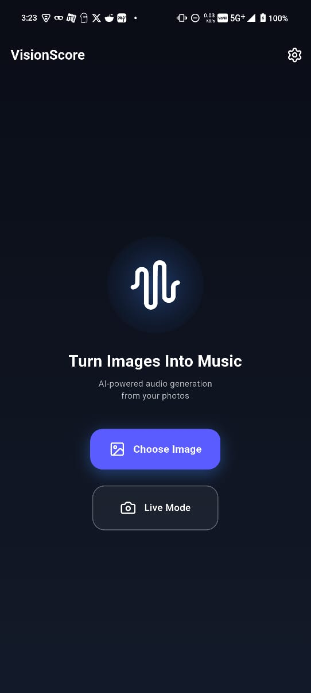
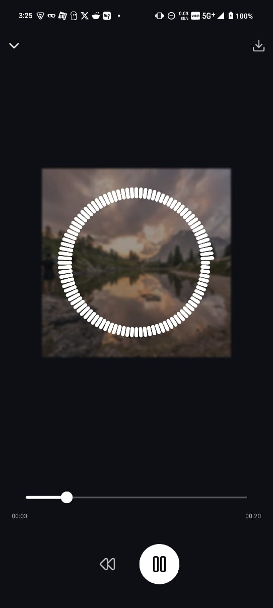
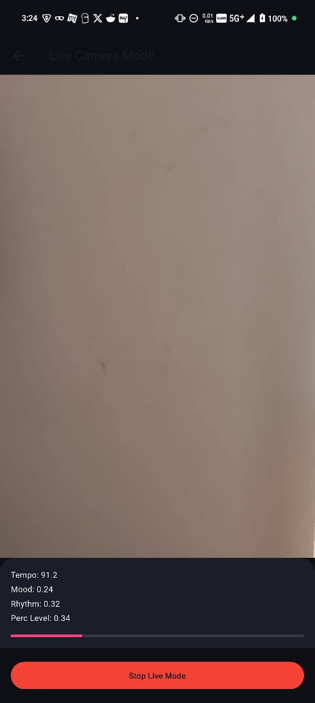

# VisionScore

**AI-powered Image & Live Camera → Music Generator (On-Device, ARM-Optimized)**

VisionScore converts **images** and **live camera feed** into music using **on-device AI (TensorFlow Lite)** and a fully custom **C++ DSP synthesizer**.
Runs with **no internet**, **low latency**, and is optimized for **Arm-based Android devices**.

Features

* **Image → Music**: Converts photos into unique musical soundscapes
* **Live Camera Mode**: Real-time visual-driven music using AAudio low-latency engine
* **On-Device AI**: FP16-optimized TFLite models for feature extraction
* **Custom DSP Engine**: Native C++ synthesizer (melody, bass, drums, shimmer, arps)
* **Visualizer**: Real-time audio visualization
* **Offline & Private**: No server calls
* **Save as WAV**: Export generated tracks locally

## Installation (APK)

You can download the latest release here:

➡️ **[Download APK](./releases)**
https://github.com/Herogo3241/VisionScore/releases/tag/v0.1.0


1. Download the APK
2. Enable *Install Unknown Apps*
3. Install & run VisionScore


## Build From Source (Flutter)

### Prerequisites

* Flutter 3.0+
* Android NDK (for native DSP)
* Android Studio or CLI

### Setup

```bash
flutter pub get
```

### Build release APK

```bash
flutter build apk --release
```

### Install to device

```bash
adb install build/app/outputs/flutter-apk/app-release.apk
```


## 🧠 Tech Stack

* **Flutter** (UI + platform integration)
* **TensorFlow Lite**
* **C++ DSP Engine**
* **AAudio (Android NDK)**
* **JNI Bridge**: Flutter ↔ Native C++ communication


## 📸 Screenshots

### HomeScreen


### Player


### Live Audio


### Settings and benchmark


## 🛠 How It Works (Short Summary)

1. **TFLite model** extracts a 64-dimensional visual embedding
2. A second MLP converts embedding → music parameters:
   * tempo
   * mood
   * rhythm density
   * key / scale
   * percussion level
3. **C++ DSP synthesizer** uses these to create full stereo music
4. In **Live Mode**, parameters update every frame and AAudio generates audio buffers in real time
5. Audio is played and visualized instantly


